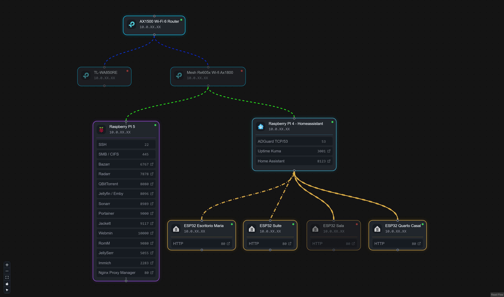

# home-server

Repositório para registrar minha experiência montando e operando um **home server self-hosted**. Aqui documento o que instalei, por que escolhi cada ferramenta e como as peças se encaixam — não é um repositório para armazenar código e configurações.

## Sobre este repositório

Este projeto tem caráter **educativo**, de **contribuição** e **diversão** para entusiastas de automação residencial, mídia, jogos retro, containers e IoT. Os arquivos `docker-compose` e `env.example` presentes aqui são **exemplos ilustrativos** da minha stack em funcionamento — servem como ponto de partida para estudo, não como receita pronta para copiar e colar somente.

Cada ambiente é único: hardware, rede, storage e necessidades diferem. O que funciona aqui pode precisar de adaptação no seu setup.

## Antes de começar

A documentação deste repositório é um **guia rápido**. Para configurar qualquer serviço corretamente, é **imprescindível** que você:

1. **Leia a documentação oficial** de cada aplicação — links incluídos no final de cada documento.
2. **Busque bons tutoriais** no Google e no YouTube.
3. **Entenda os conceitos** por trás de cada ferramenta antes de expor serviços na internet.

O universo de home server é **muito vasto**. Além do que está documentado aqui, existem dezenas de alternativas, integrações e projetos open source igualmente interessantes e úteis — vale explorar, experimentar e compartilhar o que aprender.

## Hardware

A infraestrutura de software documentada neste repositório roda em dois dispositivos separados, ambos com **8 GB de RAM**. Detalhes completos de placas, HATs PCIe, discos e topologia de armazenamento: [hardware/raspberry_pi/README.md](hardware/raspberry_pi/README.md).

Os ESP32 usados como Bluetooth trackers e captura de IRK na automação residencial estão documentados em [hardware/esp32/README.md](hardware/esp32/README.md) (firmware em [automations/esp32](automations/esp32/README.md)).

### Raspberry Pi 5 — containers e stacks

Responsável pelo [Portainer](apps/portainer/README.md) e por todas as [stacks Docker](apps/stacks/admin/README.md). Sistema operacional [Debian Trixie 13](https://www.raspberrypi.com/news/trixie-the-new-version-of-raspberry-pi-os/) com gerenciamento via [Webmin](https://webmin.com/) — interface web para administração do SO (usuários, serviços, arquivos, rede, entre outros).

**Armazenamento:** boot no **M.2 NVMe 256 GB** ([Geekworm X1001](https://wiki.geekworm.com/X1001)); expansão via hub [Waveshare PCIe TO 2-CH](https://www.waveshare.com/wiki/PCIe_TO_2-CH_PCIe_HAT) + [Geekworm X1006](https://wiki.geekworm.com/X1006) com **HDD 2.5" 1 TB** e **M.2 SATA 256 GB**.

**Referências:** [Raspberry Pi 5](https://www.raspberrypi.com/products/raspberry-pi-5/) · [Introducing Raspberry Pi 5](https://www.raspberrypi.com/news/introducing-raspberry-pi-5/) · [Webmin](https://webmin.com/)

### Raspberry Pi 4 — automação residencial

Dedicado ao [Home Assistant](apps/home_assistant/README.md). O HA roda **diretamente no dispositivo como sistema operacional**, no modo **Supervisor** (instalação gerenciada com suporte nativo a apps/add-ons).

**Armazenamento:** boot no **SD card 32 GB**; **SSD 224 GB** na porta **USB 3.0**.

**Referência:** [Raspberry Pi 4 Model B](https://www.raspberrypi.com/products/raspberry-pi-4-model-b/)

## Visão geral

O home server combina serviços de infraestrutura, mídia, jogos, automação residencial e IoT, organizados da seguinte forma:

```
Portainer (gerenciador)
    ├── Stack Admin      → Nginx Proxy Manager + backup + túnel Cloudflare
    ├── Stack Stream     → pipeline *Arr + Jellyfin
    ├── Stack Games      → RomM
    └── Stack Immich     → fotos e vídeos (Immich)

Home Assistant (apps)    → DNS, monitoramento, HACS
Automations ESP32        → proxies Bluetooth para o HA
```

No Raspberry Pi 5, as stacks usam redes Docker locais e uma rede externa compartilhada (`proxy_network`). O **Nginx Proxy Manager** é o único serviço que publica portas no host (`80`/`443`/`81`) e roteia as requisições HTTP/HTTPS para os containers pelo nome. Detalhes em [apps/stacks/admin/README.md](apps/stacks/admin/README.md).

| Área               | Função                                                    |
| ------------------ | --------------------------------------------------------- |
| **Portainer**      | Gerenciamento de containers Docker (Raspberry Pi 5)       |
| **Stacks**         | Serviços agrupados por contexto, deploy via Portainer     |
| **Proxy**          | Nginx Proxy Manager — entrada HTTP/HTTPS na `proxy_network` |
| **Home Assistant** | Automação residencial e apps integrados (Raspberry Pi 4)  |
| **ESP32**          | Extensão de alcance BLE para rastreamento de dispositivos |




## Documentação


### Infraestrutura


| Documento                             | Descrição                                                      |
| ------------------------------------- | -------------------------------------------------------------- |
| [Portainer](apps/portainer/README.md) | Gerenciador de containers — ponto de partida da infraestrutura |


### Stacks Docker


| Stack                                  | Descrição                                                            |
| -------------------------------------- | -------------------------------------------------------------------- |
| [admin](apps/stacks/admin/README.md)   | Nginx Proxy Manager, backup do Portainer e Cloudflare Tunnel         |
| [stream](apps/stacks/stream/README.md) | Pipeline *Arr (Sonarr, Radarr, Bazarr, Jellyfin, Seerr, qBittorrent) |
| [games](apps/stacks/games/README.md)   | RomM — gerenciador de ROMs no browser                                |
| [immich](apps/stacks/immich/README.md) | Immich — fotos e vídeos self-hosted                                  |


### Automação e IoT


| Documento                                                | Descrição                                                |
| -------------------------------------------------------- | -------------------------------------------------------- |
| [Home Assistant](apps/home_assistant/README.md)          | Apps instalados: HACS, AdGuard Home, Uptime Kuma, Immich |
| [ESP32 — Hardware](hardware/esp32/README.md)             | DevKit V1, DevKitC V4 e Mini C3 — inventário e specs     |
| [ESP32 — Bluetooth Tracker](automations/esp32/README.md) | Proxies BLE integrados ao Home Assistant via ESPHome     |


## Estrutura do repositório

```
home-server/
├── apps/
│   ├── portainer/           # Gerenciador Docker (iniciado via terminal)
│   ├── home_assistant/      # Documentação dos apps do HA
│   └── stacks/
│       ├── admin/           # Ferramentas administrativas
│       ├── games/           # Jogos retro (RomM)
│       ├── immich/          # Fotos e vídeos (Immich)
│       └── stream/          # Mídia e streaming (*Arr + Jellyfin)
├── automations/
│   └── esp32/               # Proxies Bluetooth (ESPHome)
├── hardware/
│   ├── raspberry_pi/        # Placas, HATs PCIe e armazenamento
│   └── esp32/               # DevKits ESP32 (BLE tracker / IRK)
├── shared/                  # Arquivos úteis compartilhados com o repositório
└── README.md
```


## Contribuições

Sugestões, correções e ideias são bem-vindas via issues e pull requests. Se este repositório ajudar alguém a dar os primeiros passos no mundo self-hosted, já cumpriu o objetivo.

---

*Lembre-se: a melhor documentação sempre será a oficial de cada projeto. Este repositório é um mapa da minha jornada — o caminho detalhado, você constrói com as fontes primárias.*