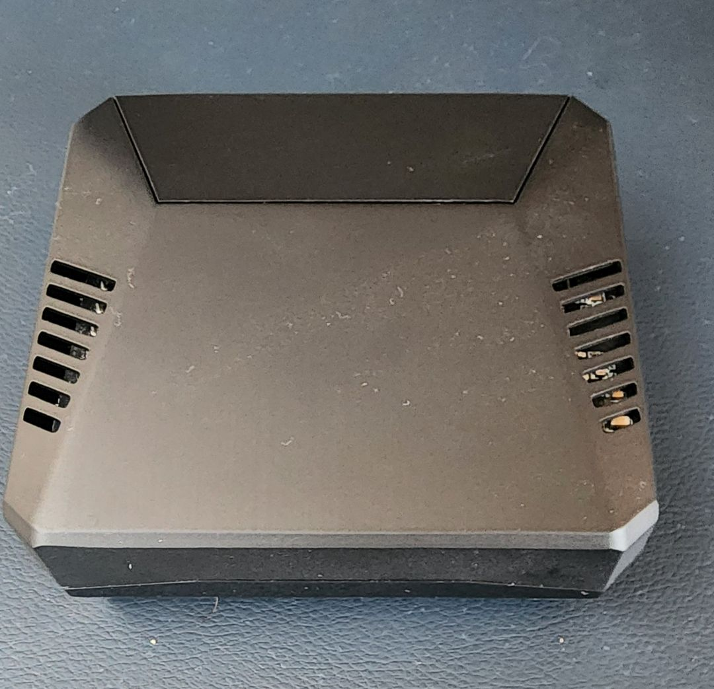
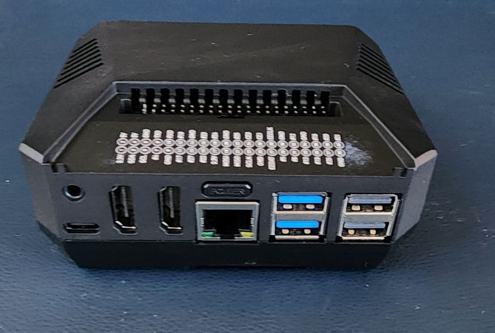
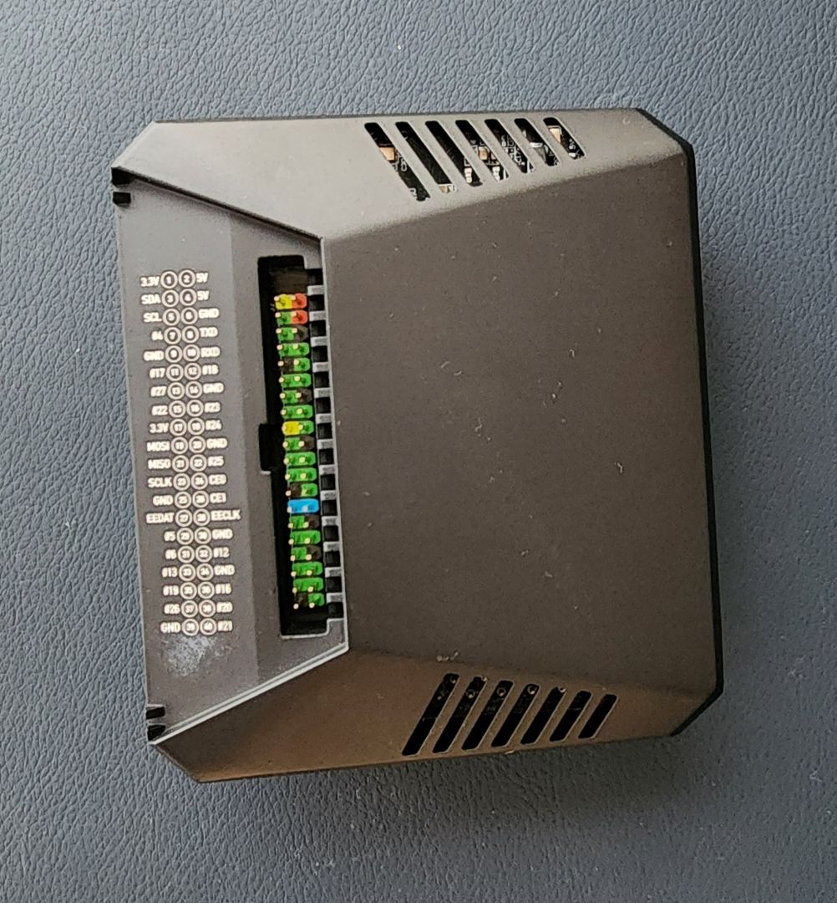

# Raspberry Pi 5


Placa principal da infraestrutura. Roda [Debian Trixie 13](https://www.raspberrypi.com/news/trixie-the-new-version-of-raspberry-pi-os/), hospedando o [Portainer](../apps/portainer/README.md) e as [stacks Docker](../apps/stacks/admin/README.md).

### Especificações da placa

O [Raspberry Pi 5](https://www.raspberrypi.com/products/raspberry-pi-5/) traz: CPU Cortex-A76 quad-core a 2,4 GHz, GPU VideoCore VII, 2× USB 3.0 a 5 Gbps, Ethernet Gigabit, Wi-Fi 802.11ac e, principalmente para este setup, **interface PCIe 2.0 x1** para periféricos de alta velocidade. Mais detalhes no anúncio oficial: [Introducing: Raspberry Pi 5](https://www.raspberrypi.com/news/introducing-raspberry-pi-5/).

### Expansão PCIe — topologia

O setup atual utiliza o case **Argon One v3 M.2 NVMe PCIE**, que integra um HAT PCIe para conexão direta de armazenamento NVMe. O disco de boot é conectado diretamente ao HAT PCIe do case, enquanto o armazenamento de massa é gerenciado via USB 3.0.

```
Raspberry Pi 5
    │
    └── Argon One v3 M.2 NVMe PCIE Case
        ├── Slot M.2 NVMe → M.2 NVMe [sistema operacional]
        └── Porta USB 3.0 → Hub USB com Fonte → HDD 1TB
```

#### Argon One v3 M.2 NVMe PCIE Case

Case compacto que inclui um HAT PCIe dedicado para expansão de alta velocidade. Diferente da versão v1, esta montagem simplifica a conexão do disco principal.

- **Manual:** [Argon One v3 Case and M.2 NVMe PCIE Case Manual](https://argon40.com/blogs/argon-resources/argon-one-v3-case-and-m-2-nvme-pcie-case-manual)

#### Armazenamento — NVMe (boot)

O disco de boot está montado diretamente no slot M.2 NVMe integrado ao case Argon One v3.

| Item | Detalhe |
| ---- | ------- |
| **Disco** | M.2 NVMe |
| **Função** | Sistema operacional (boot) |
| **Conexão** | Slot M.2 NVMe via HAT PCIe |

#### Armazenamento — HDD (massa)

O HDD de 1TB é conectado através de um hub USB com alimentação externa.

| Item | Detalhe |
| ---- | ------- |
| **Disco** | HDD 2.5" 1 TB |
| **Função** | Armazenamento em massa |
| **Conexão** | Hub USB 3.0 com fonte externa |

> **Nota sobre a alimentação:** O uso de um hub USB com fonte de alimentação própria é obrigatório para o HDD de 1TB. Isso ocorre devido às limitações de corrente das portas USB do Raspberry Pi 5, que não conseguem suprir a alta demanda de energia de discos rígidos de grande capacidade de forma estável.

### Resumo do Setup Atual

| Disco | Interface | Capacidade | Função |
| ----- | --------- | ---------- | ------ |
| M.2 NVMe | PCIe (Argon One v3) | - | Sistema operacional |
| HDD 2.5" | USB 3.0 (via Hub com fonte) | 1 TB | Armazenamento em massa |

---

## Referências

### Hardware e Cases
- [Argon One v3 M.2 NVMe PCIE Case Manual](https://argon40.com/blogs/argon-resources/argon-one-v3-case-and-m-2-nvme-pcie-case-manual)

### Comparativo de Periféricos
- [Configuração v1 (Waveshare + Geekworm)](../v1/README.md)

### Imagens do Hardware


